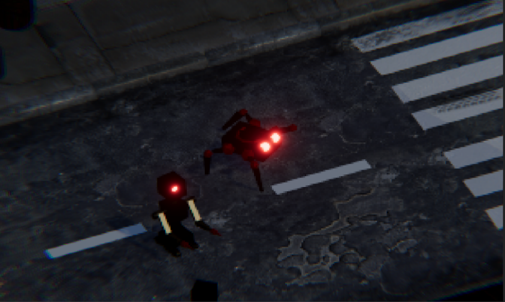

## Trailer

<iframe width="660" height="415" src="https://www.youtube.com/embed/Art4-wIBxCc" title="YouTube video player" frameborder="0" allow="accelerometer; autoplay; clipboard-write; encrypted-media; gyroscope; picture-in-picture; web-share" allowfullscreen></iframe>

## Game Concept

Players will take on the role of a powerful universal model cyborg, who can accept any kind of adaptive change or gear. As they progress through the game's procedurally generated levels, players will face off against hordes of cyborg enemies, including humanoid and animal cyborgs with enhanced strength, speed, and powers

To survive, players will need to utilize a variety of combat skills and strategies, including close-quarters combat, ranged attacks, and stealth. They will also be able to customize and upgrade their cyborg's abilities and equipment, choosing from a wide range of upgrades and gear options to suit their playstyle

However, players must be careful, as the game features permadeath. When they die, they will have to start over from the beginning, facing a new set of procedurally generated levels and enemies. With its challenging gameplay and endless replayability, ”TechnoScourge: Rise of the Adaptive” is sure to provide
players with hours of intense, action-packed fun

## Game Developers
- David  ̊Asberg dasberg@kth.se
- Jesper Lidbaum jlidbaum@kth.se
- Zhongyue Wu zhongyue@kth.se 
- Laila Arman lailaa@kth.se
- Wanqing Zhou wanqingz@kth.se
