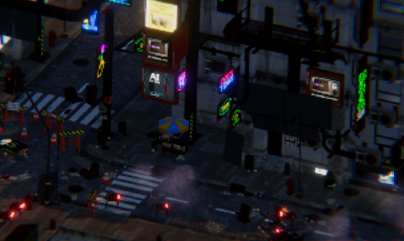

## Game Concept

Players will take on the role of a powerful universal model cyborg, who can accept any kind of adaptive change or gear. As they progress through the game's procedurally generated levels, players will face off against hordes of cyborg enemies, including humanoid and animal cyborgs with enhanced strength, speed, and powers.

To survive, players will need to utilize a variety of combat skills and strategies, including close-quarters combat, ranged attacks, and stealth. They will also be able to customize and upgrade their cyborg's abilities and equipment, choosing from a wide range of upgrades and gear options to suit their playstyle.

## Trailer

<iframe width="560" height="315" src="https://www.youtube.com/embed/Art4-wIBxCc" title="YouTube video player" frameborder="0" allow="accelerometer; autoplay; clipboard-write; encrypted-media; gyroscope; picture-in-picture; web-share" allowfullscreen></iframe>

## Game Developers
- David  ̊Asberg dasberg@kth.se
- Jesper Lidbaum jlidbaum@kth.se
- Zhongyue Wu zhongyue@kth.se 
- Laila Arman lailaa@kth.se
- Wanqing Zhou wanqingz@kth.se